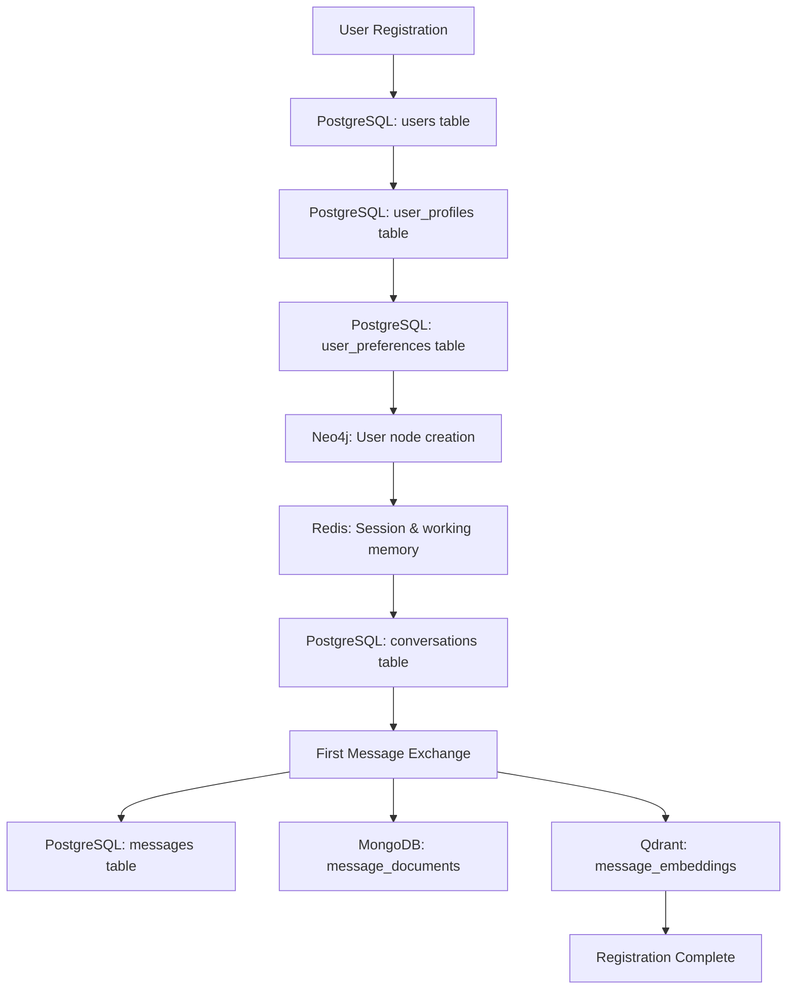

# VATO User Registration & Initial State Configuration
## Double Diamond Analysis Based on Database Architecture

---

## Table of Contents

1. [Double Diamond Framework](#double-diamond-framework)
2. [Diamond 1: Discover & Define - Registration Needs](#diamond-1-discover--define---registration-needs)
3. [Diamond 2: Develop & Deliver - Registration Flow](#diamond-2-develop--deliver---registration-flow)
4. [User Registration Journey](#user-registration-journey)
5. [Database Integration Flow](#database-integration-flow)
6. [Initial State Configuration](#initial-state-configuration)
7. [Post-Registration Experience](#post-registration-experience)

---

## Double Diamond Framework

```
DISCOVER → DEFINE → DEVELOP → DELIVER

   ◇              ◇
  / \            / \
 /   \          /   \
|     |        |     |
 \   /          \   /
  \ /            \ /
   ◇              ◇

Problem Space    Solution Space
```

**Focus**: Creating a seamless registration experience that properly initializes VATO's multi-database architecture and sets up the cognitive memory system for new users.

---

## Diamond 1: Discover & Define - Registration Needs

### Phase 1: DISCOVER - Technical & User Requirements

#### Database Architecture Requirements

Based on VATO's actual schema, registration must initialize:

**Identity Domain (PostgreSQL)**:
- `users` table with proper authentication setup
- `user_profiles` with personalization data
- `user_preferences` for behavior customization
- `auth_sessions` for secure session management

**Graph Extensions (Neo4j)**:
- User node creation for relationship tracking
- Initial interest and expertise domain setup
- Behavioral pattern initialization

**Working Memory (Redis)**:
- Session state initialization
- Working memory context setup
- Preference caching

#### User Experience Requirements

**Registration Pain Points to Solve**:
- Complex multi-step forms that lose users
- Unclear privacy settings during signup
- No immediate value demonstration
- Generic onboarding that doesn't personalize quickly
- Technical complexity exposed to users

**VATO-Specific Needs**:
- Memory system needs initial context to be useful
- Multi-database architecture must be transparent
- Privacy preferences critical due to memory persistence
- Cognitive modes need early configuration
- Document integration should be optional but encouraged

### Phase 2: DEFINE - Core Problem Statement

**Problem**: *"New users need to initialize VATO's complex multi-database cognitive architecture while experiencing immediate value, without being overwhelmed by technical complexity or privacy concerns."*

**Success Criteria**:
1. Complete database initialization across all domains
2. Functional memory system ready for first conversation
3. Privacy preferences clearly understood and set
4. Initial cognitive mode configured
5. First meaningful interaction within 5 minutes

---

## Diamond 2: Develop & Deliver - Registration Flow

### Phase 3: DEVELOP - Registration Architecture

#### Multi-Database Registration Flow

```
USER INPUT → IDENTITY CREATION → COGNITIVE INITIALIZATION → FIRST INTERACTION

┌─────────────────────────────────────────────────────────────┐
│                   REGISTRATION PIPELINE                    │
├─────────────────────────────────────────────────────────────┤
│  Email/Auth → PostgreSQL (users, profiles, preferences)    │
│  ↓                                                         │
│  Profile Setup → Neo4j (user node, interests)             │
│  ↓                                                         │
│  Privacy Config → Redis (session, working memory)         │
│  ↓                                                         │
│  Mode Selection → PostgreSQL (preferences)                │
│  ↓                                                         │
│  First Chat → All Systems (conversation, memory, vectors) │
└─────────────────────────────────────────────────────────────┘
```

### Phase 4: DELIVER - Concrete Registration Experience

#### Technical Implementation Strategy

**Backend Services Required**:
- Authentication Service (handles users, auth_sessions)
- Profile Service (manages user_profiles, preferences)
- Graph Service (creates Neo4j user nodes)
- Memory Service (initializes Redis working memory)
- Conversation Service (creates first conversation)

**API Endpoints**:
```typescript
POST /api/auth/register
POST /api/profile/initialize  
POST /api/preferences/set
POST /api/conversation/start
GET  /api/onboarding/status
```

---

## User Registration Journey

### Stage 1: Account Creation
**Duration**: 30-45 seconds

#### Actions
1. User enters email and creates password
2. Email verification (optional immediate skip)
3. Basic profile information

#### Database Operations
```sql
-- Create user record
INSERT INTO users (email, auth_provider, account_tier, privacy_mode) 
VALUES ($email, 'local', 'free', 'standard');

-- Create auth session
INSERT INTO auth_sessions (user_id, session_token, device_info, expires_at)
VALUES ($user_id, $token, $device_info, NOW() + INTERVAL '24 hours');

-- Initialize user profile
INSERT INTO user_profiles (user_id, display_name, timezone, language_preference)
VALUES ($user_id, $display_name, $timezone, $language);
```

#### Interface Design
```
┌─────────────────────────────────────────────────────────┐
│  Welcome to VATO                                       │
│  Your AI that remembers and learns with you            │
│                                                         │
│  Email: [____________________]                          │
│  Password: [____________________]                       │
│  Display Name: [____________________]                   │
│                                                         │
│  [ Continue ] [ Sign in with Google ]                  │
│                                                         │
│  By continuing, you agree to our Terms and Privacy     │
└─────────────────────────────────────────────────────────┘
```

**Thoughts & Emotions**: 
- *Curious*: "What makes this AI different?"
- *Cautious*: "Another signup form..."
- *Hopeful*: "The memory aspect sounds interesting"

---

### Stage 2: Privacy & Data Control Setup
**Duration**: 1-2 minutes

#### Actions
1. Explain VATO's memory system
2. Set privacy preferences
3. Configure data retention settings

#### Database Operations
```sql
-- Set privacy preferences
INSERT INTO user_preferences (user_id, category, key, value) VALUES
($user_id, 'privacy', 'data_retention_period', '"1_year"'),
($user_id, 'privacy', 'memory_consolidation', 'true'),
($user_id, 'privacy', 'analytics_sharing', '"aggregated_only"'),
($user_id, 'privacy', 'conversation_analysis', 'true');
```

#### Interface Design
```
┌─────────────────────────────────────────────────────────┐
│  🧠 VATO's Memory System                                │
│                                                         │
│  Unlike other AI, VATO remembers your conversations,    │
│  preferences, and context over time. You control:       │
│                                                         │
│  Memory Retention:                                      │
│  ○ 6 months   ● 1 year   ○ 2 years   ○ Custom          │
│                                                         │
│  Privacy Level:                                         │
│  ○ Strict     ● Standard ○ Permissive                  │
│                                                         │
│  ✓ Conversations stay private and encrypted            │
│  ✓ You can delete any memory at any time               │
│  ✓ Export your data whenever you want                  │
│                                                         │
│  [ Continue with these settings ] [ Customize more ]   │
└─────────────────────────────────────────────────────────┘
```

**Thoughts & Emotions**:
- *Impressed*: "They're being transparent about data use"
- *Relieved*: "I have control over my information"  
- *Confident*: "This feels trustworthy"

---

### Stage 3: Cognitive Mode Selection
**Duration**: 1 minute

#### Actions
1. Brief explanation of VATO's modes
2. Select primary working style
3. Set communication preferences

#### Database Operations
```sql
-- Set behavioral preferences
INSERT INTO user_preferences (user_id, category, key, value) VALUES
($user_id, 'behavior', 'primary_mode', '"research"'),
($user_id, 'behavior', 'communication_style', '"professional"'),
($user_id, 'behavior', 'response_length', '"detailed"'),
($user_id, 'behavior', 'citation_level', '"comprehensive"');

-- Create initial conversation with mode
INSERT INTO conversations (user_id, title, mode, context_window_size)
VALUES ($user_id, 'Getting Started', 'research', 20);
```

#### Neo4j Graph Setup
```cypher
// Create user node
CREATE (u:User {
    user_id: $user_id,
    created_at: datetime(),
    primary_mode: 'research'
})

// Initialize interests based on mode selection
CREATE (u)-[:INTERESTED_IN {
    strength: 0.6,
    since: datetime(),
    source: 'onboarding'
}]->(topic:Topic {name: 'research_methodology'})
```

#### Interface Design
```
┌─────────────────────────────────────────────────────────┐
│  🎯 How do you primarily work?                          │
│                                                         │
│  VATO adapts its personality to match your style:       │
│                                                         │
│  ● Research & Analysis                                  │
│    "I need detailed, well-sourced information"         │
│                                                         │
│  ○ Creative & Brainstorming                             │
│    "I want inspiration and creative exploration"       │
│                                                         │
│  ○ Quick & Efficient                                    │
│    "Give me concise, actionable answers"               │
│                                                         │
│  ○ Teaching & Learning                                  │
│    "Help me understand concepts deeply"                │
│                                                         │
│  You can always change this later in settings.         │
│                                                         │
│  [ Continue ]                                           │
└─────────────────────────────────────────────────────────┘
```

**Thoughts & Emotions**:
- *Engaged*: "This is already personalizing to me"
- *Excited*: "Research mode sounds perfect for my work"
- *Anticipatory*: "I want to see how it responds differently"

---

### Stage 4: Knowledge Integration (Optional)
**Duration**: 2-3 minutes

#### Actions
1. Option to upload initial documents
2. Connect cloud storage (optional)
3. Explain document processing

#### Database Operations
```sql
-- If user uploads documents
INSERT INTO documents (user_id, title, document_type, storage_path, processing_status)
VALUES ($user_id, $title, $doc_type, $storage_path, 'pending');

-- Create processing task
INSERT INTO tasks (user_id, task_type, input_data, status)
VALUES ($user_id, 'document_processing', $document_data, 'pending');
```

#### Interface Design
```
┌─────────────────────────────────────────────────────────┐
│  📚 Connect Your Knowledge (Optional)                   │
│                                                         │
│  VATO works best when it knows about your projects,     │
│  research, and interests. You can:                      │
│                                                         │
│  [ 📄 Upload Documents ]                                │
│    PDFs, Word docs, notes, research papers             │
│                                                         │
│  [ 🔗 Connect Google Drive ]                            │
│    Access your existing files                          │
│                                                         │
│  [ 📝 Import from Notion ]                              │
│    Bring your notes and databases                      │
│                                                         │
│  [ ⏭️  Skip for now ]                                    │
│    Start chatting and add documents later              │
│                                                         │
│  Note: Processing happens in the background.           │
│  You'll be notified when your knowledge is ready.      │
└─────────────────────────────────────────────────────────┘
```

**Thoughts & Emotions**:
- *Practical*: "I can see how this would be useful"
- *Cautious*: "Maybe I'll start small and see how it works"
- *Curious*: "I wonder how it will understand my documents"

---

### Stage 5: First Conversation
**Duration**: 2-5 minutes

#### Actions
1. Guided first interaction
2. Demonstrate memory and personalization
3. Show citation system

#### Database Operations
```sql
-- Create first message
INSERT INTO messages (conversation_id, role, content, intent_classification, emotional_tone)
VALUES ($conv_id, 'user', $content, $intent_json, $emotion_json);

-- Store in MongoDB for full context
db.message_documents.insertOne({
    message_id: uuid,
    conversation_id: conv_id,
    user_id: user_id,
    role: "user",
    content: { text: content },
    analysis: {
        intent: { primary: "onboarding", confidence: 0.95 },
        emotion: { primary: "curious", intensity: 0.7 }
    }
});
```

#### Redis Working Memory Setup
```redis
# Initialize working memory
HSET working_memory:{user_id} 
  "conversation_context" "first_interaction"
  "user_mode" "research" 
  "session_goals" "demonstrate_capabilities"
  "personalization_level" "initial"
```

#### Vector Embedding Creation
```python
# Store message embedding in Qdrant
points = [{
    "id": message_id,
    "vector": embedding_vector,
    "payload": {
        "user_id": user_id,
        "conversation_id": conversation_id,
        "message_type": "onboarding",
        "timestamp": datetime.now()
    }
}]
qdrant_client.upsert(collection_name="message_embeddings", points=points)
```

#### Interface Design
```
┌─────────────────────────────────────────────────────────┐
│  💬 Let's have our first conversation!                  │
│                                                         │
│  Ask me anything to see how I work. Here are some      │
│  ideas based on your Research mode:                    │
│                                                         │
│  • "Explain quantum computing with detailed sources"   │
│  • "Analyze the latest trends in renewable energy"     │
│  • "Help me understand machine learning fundamentals"  │
│                                                         │
│  [________________________________]  [ Send ]         │
│                                                         │
│  💡 I'll remember this conversation for future         │
│     reference and build on what we discuss.           │
└─────────────────────────────────────────────────────────┘
```

**Example First Interaction**:

**User**: "Explain quantum computing with detailed sources"

**VATO Response**:
```
I'll provide a comprehensive overview of quantum computing with scholarly sources.

## Quantum Computing Fundamentals

Quantum computing leverages quantum mechanical phenomena to process information in ways that classical computers cannot. Unlike classical bits that exist in states of 0 or 1, quantum bits (qubits) can exist in superposition, allowing them to be in multiple states simultaneously [1].

### Key Principles:

**Superposition**: Qubits can exist in a combination of 0 and 1 states until measured, enabling parallel processing of multiple possibilities [2].

**Entanglement**: Quantum particles become correlated in such a way that the quantum state of one particle cannot be described independently of the others [3].

**Quantum Interference**: Quantum algorithms use interference to amplify correct answers and cancel out wrong ones [4].

### Current Applications:

- **Cryptography**: Shor's algorithm can factor large integers exponentially faster than classical computers [1]
- **Optimization**: Quantum annealers show promise for complex optimization problems [5]
- **Drug Discovery**: Simulating molecular interactions for pharmaceutical research [6]

---

**Sources:**
[1] Nielsen, M. & Chuang, I. (2010). "Quantum Computation and Quantum Information"
[2] Preskill, J. (2018). "Quantum Computing in the NISQ era" - Quantum Journal
[3] Einstein, A. et al. (1935). "Can Quantum-Mechanical Description of Physical Reality Be Considered Complete?" - Physical Review
[4] Grover, L. (1996). "A fast quantum mechanical algorithm for database search" - STOC '96
[5] Farhi, E. et al. (2014). "A Quantum Approximate Optimization Algorithm" - arXiv:1411.4028
[6] Biamonte, J. et al. (2017). "Quantum machine learning" - Nature

💡 I've saved this explanation in your memory. Next time you ask about quantum topics, I'll reference this foundation and build upon it.
```

**Thoughts & Emotions**:
- *Impressed*: "Wow, those citations are exactly what I need"
- *Excited*: "It's already adapting to my research style"
- *Convinced*: "This memory feature is going to be incredibly useful"

---

## Database Integration Flow

### Complete Registration Data Flow



### Database State After Registration

**PostgreSQL State**:
```sql
-- User created with preferences
users: user_id, email, auth_provider='local', account_tier='free'
user_profiles: profile_id, user_id, display_name, timezone, language_preference
user_preferences: 8-12 preference rows covering privacy, behavior, communication
auth_sessions: session_id, user_id, session_token, expires_at
conversations: conversation_id, user_id, mode, status='active'
```

**Neo4j State**:
```cypher
// User node with initial relationships
(u:User {user_id, created_at, primary_mode})-[:INTERESTED_IN]->(topics)
```

**Redis State**:
```
working_memory:{user_id}: Hash with session context
session:{session_token}: User session data
user_preferences:{user_id}: Cached preference data
```

**After First Message**:
```
PostgreSQL: messages table populated
MongoDB: message_documents with full context
Qdrant: message_embeddings for semantic search
```

---

## Initial State Configuration

### Default User Preferences by Mode

#### Research Mode Defaults
```json
{
  "behavior": {
    "primary_mode": "research",
    "communication_style": "academic_professional",
    "response_length": "detailed",
    "citation_level": "comprehensive",
    "fact_checking": "strict"
  },
  "privacy": {
    "data_retention_period": "1_year", 
    "memory_consolidation": true,
    "conversation_analysis": true,
    "analytics_sharing": "aggregated_only"
  },
  "ui": {
    "theme": "professional",
    "sidebar_expanded": true,
    "show_citations_inline": true,
    "conversation_density": "spacious"
  }
}
```

#### Creative Mode Defaults
```json
{
  "behavior": {
    "primary_mode": "creative",
    "communication_style": "collaborative_inspiring", 
    "response_length": "expansive",
    "citation_level": "contextual",
    "idea_generation": "high_creativity"
  },
  "privacy": {
    "data_retention_period": "1_year",
    "memory_consolidation": true, 
    "mood_tracking": true,
    "inspiration_logging": true
  },
  "ui": {
    "theme": "warm_creative",
    "sidebar_expanded": false,
    "show_inspiration_board": true,
    "conversation_density": "flowing"
  }
}
```

### Memory System Initialization

#### Working Memory Setup
```python
def initialize_working_memory(user_id: str, mode: str):
    redis_client.hset(f"working_memory:{user_id}", {
        "context_window_size": 20,
        "conversation_state": "new_user",
        "primary_mode": mode,
        "personalization_level": "basic",
        "learning_rate": "high",  # Learn quickly from new user
        "memory_consolidation_threshold": 5  # messages
    })
```

#### Neo4j Interest Graph
```cypher
// Initialize based on selected mode
MATCH (u:User {user_id: $user_id})
CREATE (u)-[:INTERESTED_IN {
    strength: 0.5,
    since: datetime(),
    source: 'onboarding',
    evidence_count: 1
}]->(interest:Topic {
    name: $topic_name,
    category: $mode,
    created_during_onboarding: true
})
```

---

## Post-Registration Experience

### First 5 Minutes Success Criteria

**Technical Validation**:
- [ ] All database records created successfully
- [ ] Session authenticated and cached
- [ ] Memory system operational
- [ ] First conversation embedding stored
- [ ] User preferences applied to interface

**User Experience Validation**:
- [ ] User completes first meaningful interaction
- [ ] Demonstrates understanding of memory feature
- [ ] Shows appropriate response style for selected mode
- [ ] User expresses satisfaction with initial experience
- [ ] User proceeds to second interaction

### Progressive Disclosure Strategy

#### Days 1-3: Foundation Building
- Demonstrate basic memory across conversations
- Show personalization adapting to user style
- Encourage document uploads with guided tutorials
- Highlight useful features organically

#### Week 1: Habit Formation  
- Proactively suggest relevant features
- Show cross-conversation memory in action
- Introduce more advanced modes
- Gather feedback on experience quality

#### Month 1: Power User Development
- Advanced personalization options
- Integration with external tools
- Community features introduction
- Feedback loop optimization

---

## Success Metrics & Monitoring

### Registration Funnel Metrics
- **Start to Complete**: < 5 minutes target
- **Completion Rate**: > 85% target
- **Database Error Rate**: < 0.1%
- **First Message Success**: > 95%

### User Experience Metrics
- **First Session Duration**: > 10 minutes indicates engagement
- **Return Rate Day 1**: > 60%
- **Feature Discovery Rate**: Track preference customization
- **Support Ticket Rate**: < 2% of new registrations

### Technical Performance Metrics
- **Registration API Latency**: < 200ms per call
- **Database Write Success**: 99.9%
- **Memory System Initialization**: < 1 second
- **Cross-Database Consistency**: 100%

---

## Error Handling & Edge Cases

### Registration Failures
- **Database Connection Issues**: Graceful fallback with retry logic
- **Email Verification Problems**: Allow immediate access with periodic reminders
- **Preference Sync Failures**: Use sensible defaults, background retry
- **Memory Initialization Errors**: Still allow chat, fix in background

### User Experience Edge Cases
- **Privacy-Conscious Users**: Extra explanation and stricter defaults
- **Quick-Start Users**: Skip optional steps, essential setup only
- **Mobile Users**: Simplified interface, core functionality preserved
- **Returning Users**: Skip onboarding, restore previous preferences

---

This registration flow ensures that VATO's complex multi-database architecture is properly initialized while providing an intuitive, value-driven user experience that demonstrates the system's unique memory and personalization capabilities from the very first interaction.